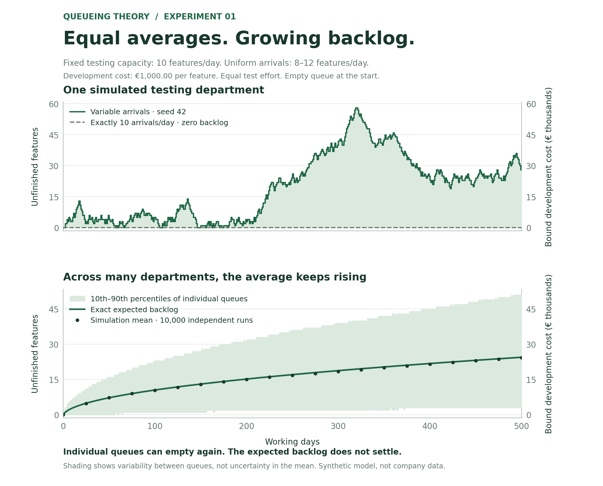

# Queueing Theory

Small, reproducible Python experiments about queues in software and system testing.
The project grows by one focused script at a time, accompanied by figures that can
be discussed and shared in a series of posts.

## Run the first experiment

Requires Python 3.10 or newer. From this directory:

```bash
python -m venv .venv
source .venv/bin/activate
python -m pip install -r requirements.txt
python scripts/01_balanced_capacity.py --live --feature-cost 1000 --output-dir outputs/local
```

On Windows, activate with `.venv\Scripts\activate` instead. The Python script opens
a live player in your browser. Press **Play**, advance one phase at a time, or use
the day slider to jump to the start of a day. Playback speed changes only how fast
you watch; it does not change the testing capacity or arrival process.

The player shows the number of features awaiting testing and their already-paid
development cost. It works offline, with no server or external JavaScript libraries.
If no browser opens, open `outputs/local/figures/01_live_queue.html` manually.
The repository also includes a ready-made player at `figures/01_live_queue.html`.
Omit `--live` on a
headless machine; the same HTML, PNG/SVG figures and CSV/JSON results are still saved.

## 01 — Balanced capacity, unstable queue

**Our capacity plan balances perfectly. Why does the testing backlog grow?**



The testing department can complete **10 features per working day**. Every morning,
**8, 9, 10, 11, or 12** features arrive, each with **20% probability**, independently
of previous days. This is a discrete uniform distribution with mean 10. These
features have already been implemented and their development cost paid.
All features require the same testing effort. All arrivals occur before that day's
testing. The queue starts empty. Unfinished features carry over without a capacity
limit; features are not discarded, cancelled or abandoned.

The comparison case receives exactly 10 features every day, with the same capacity.
Its end-of-day backlog remains zero. The model describes one aggregate testing
department, not a particular employee or a detailed multi-server system.

The original two-point arrival law (8 or 12 with 50% probability each) remains
available as `--arrival-distribution two-point`. Uniform 8–12 arrivals have variance
2; the original two-point law has variance 4 (in squared feature counts). Both have
mean 10, but changing the law also changes the amount of variability and therefore
the size of the expected backlog. Neither law is fitted to actual department data.

For end-of-day backlog `Q`, arrivals `A`, and capacity `C`:

```text
Q[next day] = max(0, Q[current day] + A[next day] - C)
completed  = min(C, Q[current day] + A[next day])
```

### Development spend tied up in the queue

Every feature has a fixed development cost, **€1,000 in the example**. Change it
with `--feature-cost 1250.50`. Currency amounts are computed in integer cents.

```text
bound development cost = waiting features × development cost per feature
```

If 24 implemented features await testing at €1,000 each, €24,000 of development
spend is tied up in the testing queue. If the backlog falls to 18, that falls to
€18,000. A feature waiting for another day does not incur its development cost again.

Testing moves a feature to **ready to sell**. The metric follows paid development
cost in the queue; it does not measure lost revenue, sales value, profit, a formal
accounting asset, or cash recovered. No sale occurs in this model. It excludes
features still in development and those already tested but awaiting sale. Testing
cost, financing costs and the cost of delay are not modeled in this experiment.

At every day end, cumulative development spend equals the development cost of
waiting features plus the development cost of all tested features. No features or
development costs disappear from that accounting.

### What the figure shows

- **Live player:** numbered features move from incoming work into the testing queue,
  then to tested work, with the oldest features tested first. Each day has three
  visual phases: start of day, arrivals joining, and testing complete. Counts and
  development spend update at every phase. Incoming features enter the queue-cost
  total when they join the queue. Tested work is labeled **today**, not cumulative.
  Up to 60 tiles appear in each area; any additional features are explicitly counted.
  Python supplies all counts, costs and feature identities; the browser replays them.
- **Live history:** queue length at the end of each completed day. It updates after
  testing, excludes future days, and uses fixed axes so scaling cannot exaggerate
  changes. The three phases illustrate event order, not intra-day service times.
- **Top:** one reproducible random path, compared with regular arrivals.
- **Bottom:** exact expected backlog, independently checked against 10,000
  simulated paths. The shaded region is the 10th–90th percentile range of
  individual queues, **not** a confidence interval for the mean.
- Capacity stays fixed throughout. Only arrivals vary.
- The static figure's right axes translate backlog into development cost.

Unused capacity cannot be saved for tomorrow; unfinished work can. For example,
8 arrivals on Monday and 12 on Tuesday give 20 arrivals and 20 available service
slots, yet only 18 completions by Tuesday: two slots were unavailable when needed.
Reversing the order (12 then 8) clears the queue. The order matters.

### The precise claim

With positive, independent arrival fluctuations and exactly balanced mean
arrival demand and service capacity, this model has **no stationary backlog
distribution**. Starting from an empty queue, its expected backlog grows without
a finite limit. For this particular model it grows on the order of the square
root of elapsed time, rather than linearly.

**An individual queue can shrink and empty again.** It is incorrect to claim that
every queue grows monotonically or that it can never clear. In this idealized
model it returns to zero repeatedly, while the mean return time is infinite.
Each finite-time expected backlog is finite.

Balance here means equality of **expected rates**, not exact equality of arrivals
and available service slots in every finite simulation. The script reports actual
arrival averages. Finite random paths are never forced to have equal arrival
totals, and seeds are not selected to produce an impressive-looking backlog.

This experiment demonstrates the effect of variability at critical load. It does
not estimate a real team's performance or prescribe a universal utilization
target. There is no rework, priority scheduling, absence, varying feature effort,
overtime, throttling or seasonal demand. These belong in later experiments.

### Reproduce and explore

```bash
# Default: 500 working days, 10,000 independent runs, seed 42.
python scripts/01_balanced_capacity.py

# Open the live player, with a different fixed development cost per feature.
python scripts/01_balanced_capacity.py --live --feature-cost 2500

# Reproduce the original 8-or-12 arrival law, including its seed-42 sample path.
python scripts/01_balanced_capacity.py --arrival-distribution two-point --output-dir outputs/two-point

# Longer horizon; save separately to retain the reference results.
python scripts/01_balanced_capacity.py --days 2000 --output-dir outputs/long-run

# Remove arrival variability; all backlogs must remain zero.
python scripts/01_balanced_capacity.py --variation 0 --output-dir outputs/regular

# A different realization of the same model.
python scripts/01_balanced_capacity.py --seed 123 --output-dir outputs/seed-123

# Check accounting, clearing, enumeration and simulation vs exact expectation.
python -m unittest discover -s tests -v

# Optional developer check of player controls and displayed data (requires Node.js).
node tests/check_live_player.cjs
```

`--capacity` changes the fixed daily capacity and the mean arrivals together.
`--variation` sets the maximum deviation around that mean. With `uniform`, every
integer in the inclusive range is equally likely; with `two-point`, only its two
endpoints can occur. `--variation 0` produces regular arrivals in either case. This script
always models **balanced expected rates**. A capacity-reserve comparison is a
separate future experiment, not a hidden change to this one.

### Outputs

| File | Contents |
|---|---|
| `figures/01_live_queue.html` | Self-contained live player; open locally in a browser |
| `figures/01_balanced_capacity.png` | Figure for preview and sharing |
| `figures/01_balanced_capacity.svg` | Scalable version of the figure |
| `results/01_sample_path.csv` | Daily feature counts and development-cost accounting |
| `results/01_ensemble.csv` | Daily means, quantiles, standard errors, empty-queue probabilities and expected bound cost |
| `results/01_summary.json` | Parameters, final results, realized rates and software versions |

### Why the expected queue grows

Let `unused = max(0, C - Q[d] - A[d+1])`. The queue cannot be negative, so any
service capacity in excess of available work is unused. The daily accounting is:

```text
Q[d+1] = Q[d] + A[d+1] - C + unused
E[Q[d+1]] - E[Q[d]] = E[unused]       because E[A] = C
```

For uniform 8–12 arrivals and capacity 10, unused capacity can occur when the
previous backlog is 0 or 1. In this specific case:

```text
E[unused] = 0.6 * P(Q[d] = 0) + 0.2 * P(Q[d] = 1)
```

For the original two-point model, with deviation `v > 0` and an initially empty
queue, only multiples of `v` are reachable. Its expression is instead
`E[unused] = (v / 2) * P(Q[d] = 0)`.

`exact_expectation()` propagates the probabilities of every reachable integer
queue state for each day, starting with probability one at zero. It convolves the
state probabilities with the selected arrival-deviation distribution, then adds
all probability assigned to negative backlog into zero. It does not use the
steady-state formula `rho / (1 - rho)`, which is inapplicable at `rho = 1`.
Tests independently enumerate all arrival sequences over short horizons for both
laws, check simulation against the exact calculation, and track FIFO feature
identities and development costs through all three live phases.

### References

- Mor Harchol-Balter, *Performance Modeling and Design of Computer Systems:
  Queueing Theory in Action* (Cambridge University Press, 2013).
  [Author's book page](https://www.cs.cmu.edu/~harchol/PerformanceModeling/book.html).
- Karl Sigman, *Continuous-Time Markov Chains*, Columbia University, 2018,
  Critical-load recurrence and stability for the M/M/1 model.
  [Lecture notes](https://www.columbia.edu/~ks20/4106-18-Fall/Notes-CTMC.pdf).
  Our experiment uses a discrete-time reflected random walk; the M/M/1 notes
  provide related background, not a claim that the two models are identical.

## Series index

| Experiment | Script | Question |
|---|---|---|
| 01 | `scripts/01_balanced_capacity.py` | Why does matching averages fail under variability? |

Possible next topics: capacity reserves, varying feature effort, batching, priority
scheduling and rework. Each addition should change one central assumption,
include a reproducible visualization and explain its limits.

## Project layout

- `scripts/`: one numbered, runnable Python script per experiment.
- `templates/`: offline player templates populated by Python.
- `tests/`: checks for accounting and mathematical claims.
- `figures/`: committed reference figures.
- `results/`: committed reference data and reproducibility metadata.
- `outputs/`: ignored scratch results for alternate parameter sets.

All example data are synthetic. No employer, customer or project data are used.
