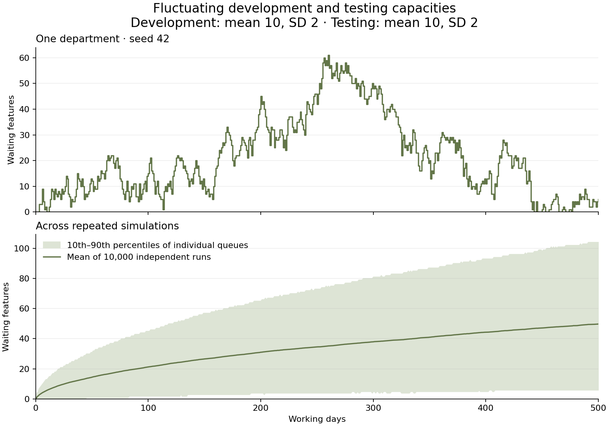

# Queueing Theory

Reproducible Python experiments about development, testing, queues, and delivery.
Start with **fluctuating development and testing capacities**. Explore the mean
and standard deviation of both departments directly in the live player.

## Try the player

**[Open the live player](https://sebastian-kom.github.io/queueing-theory/)** —
adjust both departments' capacities and run the simulation in your browser.
Nothing to install.

**Current release: [v0.1.0](https://github.com/Sebastian-Kom/queueing-theory/releases/tag/v0.1.0).**
For articles and comparisons, use the [fixed v0.1.0 player](https://sebastian-kom.github.io/queueing-theory/releases/v0.1.0/).
The release provides an offline ZIP, a standalone HTML download, checksums, and
the tagged source code. The version is also displayed inside the player.

For an immediate offline demo, download this repository and open
[`figures/02_live_queue.html`](figures/02_live_queue.html) in your browser.
No server, Python installation, or internet connection is needed to use this file.

To generate simulations and figures, use Python 3.10 or newer. From the repository
root, set up the environment once:

```bash
python -m venv .venv
source .venv/bin/activate
python -m pip install -r requirements.txt
```

On Windows, use `.venv\Scripts\activate` instead. Run the new experiment:

```bash
python scripts/02_fluctuating_capacities.py --live --output-dir outputs/local
```

To update an existing clone, run `git pull --ff-only` first. If the browser does
not open automatically, open `outputs/local/figures/02_live_queue.html` manually.

## 02 — Fluctuating capacities

**What happens when departments have the same average capacity, but their
productive days do not coincide?**

The defaults are 500 working days, with a Gaussian mean of **10 features/day** and
a standard deviation of **2** for each department. The two departments draw
independently, and draws on different days are independent. Both use the same
distribution by default, but their actual daily values differ.

Development always has enough upstream work and produces completed features at
its sampled capacity. Those features arrive **before that day's testing**.
Testing completes as many available features as its sampled capacity permits,
oldest first. Features have equal testing effort and a fixed already-paid
development cost, initially €1,000 each. The testing queue starts empty. There is
no rework, abandonment, sales process, feedback, overtime, seasonality, or
variation in feature size. This is an illustrative daily batch model, not a model
fitted to a particular company or an M/M/1 queue.

For development output `D[n]`, available testing capacity `T[n]`, and end-of-day
backlog `Q[n]`:

```text
tested[n] = min(Q[n-1] + D[n], T[n])
Q[n]      = max(0, Q[n-1] + D[n] - T[n])
unused[n] = T[n] - tested[n]
```

Unused capacity expires. Waiting features carry into the next day. Every feature
is counted once, and it is either still waiting or already tested.

### Gaussian parameters and actual feature counts

A Gaussian draw can be fractional or negative. Both departments use the same
explicit conversion:

```text
capacity = max(0, floor(mean + standard_deviation * Z + 0.5))
Z ~ Normal(0, 1)
```

This is **rounding to the nearest integer, with halves rounded upward, followed
by setting negative values to zero**. It is a rounded, zero-clamped Gaussian
approximation, not a Gaussian count distribution and not resampling until a
positive draw appears. With standard deviation zero, the count is the rounded
mean every day.

The four inputs are the parameters of the underlying Gaussian. Beneath each
distribution, the player shows the **effective count mean and standard
deviation** after conversion. These are distribution moments, distinct from the
observed averages of the current run. For the defaults, the effective mean is
approximately 10 and the standard deviation is approximately 2.0207. Large
fluctuations near zero can substantially increase the effective mean. Equal
Gaussian means with different deviations do not necessarily give equal effective
count means.

The plotted probabilities use the rounded count distribution, with a shared
axis range. For very wide distributions, adjacent counts are binned and the
height is the average probability per count. Moment calculations omit only the
upper normal tail beyond nine standard deviations. Python uses `math.erfc`;
the player's approximation agrees with its displayed three-decimal precision.

### Controls and measures

- Enter development mean/SD and testing mean/SD, then **Apply & restart**.
  Editing pauses playback; new settings take effect together from day 1.
- Comparisons reuse the **same independent standard-normal draws**. Increasing
  testing's mean therefore compares the same underlying sequence of good and bad
  days. Changing a parameter does not secretly select a different random run.
- **Play**, **Pause**, **Replay**, step through the three daily phases, change
  playback speed, or jump to the start of a working day.
- Numbered tiles keep their identities as they enter, wait, and complete testing.
  Each area shows at most 36 tiles; remaining features are explicitly counted.
- Daily testing capacity, completions, and unused slots are separate measures.
- The queue-history chart includes only completed days. Its axes stay fixed for
  each run and are recalculated when settings change. Different comparisons may
  therefore have different vertical scales; use the axis labels and counts.
- **Oldest waiting** is the age of the oldest currently queued feature.
- **Mean wait · completed so far** averages completion day minus arrival day
  over tested features only. Same-day completion is zero. This is measured in
  working-day steps; the model has no within-day service-time resolution.
  Unfinished features are excluded, so this average alone cannot characterize
  all delay in a growing queue. No completions are shown as a dash, not zero.
- Development spend waiting equals queued features × fixed development cost.
  It is counted once per feature. Testing removes it from this waiting total and
  makes the feature ready to sell; it does not imply a sale or cash recovery.

The player recalculates one illustrative path locally. Browser changes do not
rewrite the repository's saved Python results or recalculate its ensemble plot.
Use the matching command-line inputs to export a new ensemble and CSV files:

```bash
python scripts/02_fluctuating_capacities.py --live \
  --development-mean 10 --development-std 2 \
  --testing-mean 12 --testing-std 2 \
  --feature-cost 1250.50 --days 500 --runs 10000 --seed 42 \
  --output-dir outputs/reserve
```

Changing `--runs` does not alter the player's path. `--seed` changes the random
draws. Means and SDs accept values from 0 to 1000; horizons support 1–5000 days,
with at most 20 million run-days in the ensemble.

### Useful comparisons

| Question | Development mean / SD | Testing mean / SD |
|---|---:|---:|
| Balanced averages, two sources of variation | 10 / 2 | 10 / 2 |
| What does reserve capacity change? | 10 / 2 | 12 / 2 |
| What if testing has a persistent shortfall? | 10 / 2 | 8 / 2 |
| What does perfect predictability change? | 10 / 0 | 10 / 0 |
| Isolate development variability | 10 / 2 | 10 / 0 |

With independent daily increments of nonzero variance and exactly equal
**effective** means, the reflected queue has no stationary backlog distribution.
Starting empty, its expected backlog grows on the order of the square root of
elapsed time. Individual queues can shrink and empty again. When testing's
effective mean is larger, this model has a stationary distribution with finite
mean backlog. A mean shortfall leads to persistent positive drift. The
deterministic case is different: equal constant counts leave the queue empty.

For independent capacities, the variance of the daily mismatch is the sum of
their effective variances. Correlation, variable feature effort, and feedback
are future extensions, not implicit assumptions in this experiment.



The lower plot averages 10,000 independent runs. Shading is the 10th–90th
percentile range of individual queues, not a confidence interval for the mean.
The JSON and ensemble CSV report the simulation mean's standard error. No
Gaussian experiment output is labeled an exact expected backlog.

## Earlier experiment

[`01_balanced_capacity.py`](scripts/01_balanced_capacity.py) retains uniform
8–12 arrivals, fixed testing capacity, and the optional original 8/12 coin toss.
Its saved results and exact expected-backlog calculations remain reproducible.
See the [earlier model's documentation](docs/01_balanced_capacity.md).

## GitHub Pages

The workflow `.github/workflows/pages.yml` checks the models, regenerates the
default player from its Python and template sources, and publishes it as the
site's `index.html`. Changes to those sources on `main` publish automatically;
the workflow can also be run manually from GitHub's Actions tab. The current
player and archived release players are included in the deployment. They need
no server-side Python, login, or APIs. Archived files under `releases/vX.Y.Z/`
are preserved so that an article's version-specific link continues to show
the same player.

For a fork, enable **Settings → Pages → Build and deployment → Source → GitHub
Actions**, then run **Publish player to GitHub Pages**. Update the live link
above to the fork's Pages address. No additional secret or access token is needed.

## Releases and offline packages

`VERSION` identifies the current model and player. The initial release is
`0.1.0`: a usable first model that will continue to develop. Release notes are
in [`docs/releases/v0.1.0.md`](docs/releases/v0.1.0.md).

Build the offline assets with Python's standard library:

```bash
python scripts/package_release.py
```

The ZIP contains `index.html`, a quick-start README, `VERSION`, and a manifest
with file hashes. Extract it and open `index.html` in any modern browser. The
separate HTML asset works on its own. `SHA256SUMS.txt` verifies both downloads.

For a new release, update `VERSION`, regenerate `figures/02_live_queue.html`,
copy it to a **new** `releases/vX.Y.Z/index.html` directory, and add release
notes. Never replace an existing release snapshot or move a published tag.
Run the checks and packaging script, commit the files, and create a GitHub
release tagged `vX.Y.Z` at that commit with the assets from `dist/`. GitHub
also provides the source ZIP and tarball for the tag.

## Checks

```bash
python -m unittest discover -s tests -v
node tests/check_live_player.cjs
node tests/check_capacity_player.cjs
```

The tests cover accounting, FIFO feature identities and waiting ages, unused
capacity, zero variability, rounding and clamping, effective moments, common
random draws, input validation, and agreement between the Python and browser
models. The earlier analytical checks remain included. Cross-language tests use
Node when available and run in CI.
The controller checks exercise playback and parameter changes using a minimal
DOM substitute; they do not verify browser layout.

The generated offline player contains its own model and standard-normal draws.
The editable sources are `templates/02_capacity_player.html`,
`templates/02_queue_model.js`, and `templates/02_standalone.css`.

## References

- [NIST: Normal distribution](https://www.itl.nist.gov/div898/handbook/eda/section3/eda3661.htm)
- [Lindley processes and stochastic recursions](https://www.uni-muenster.de/Stochastik/lehre/WS1112/StochRekGleichungenII/book.pdf)
- [Mor Harchol-Balter: Performance Modeling and Design of Computer Systems](https://www.cs.cmu.edu/~harchol/PerformanceModeling/book.html)
